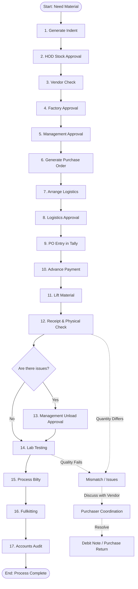

# Purchase-FMS System Workflow

## Overview
The Purchase-FMS (Purchase File Management System) is a comprehensive application designed to digitize and track the entire procurement lifecycle. It manages everything from the initial request for materials to final payment and accounting. The system ensures that every step is properly authorized, tracked, and verified, minimizing errors and improving transparency.

This document breaks down the system's workflow into simple, easy-to-understand steps, categorized by the phase of the process.

---

## Step-by-Step Process

### Phase 1: Request & Approvals
This phase handles the initial identification of a need and getting the right permissions to buy the material.
1. **Generate Indent** (`IndentForm.jsx`): A user creates an "Indent," which is a formal request for specific materials.
2. **HOD Approval** (`StockApproval.jsx`): The Head of Department (HOD) reviews the request, checks current stock levels, and approves the required quantity.
3. **Three Party / Vendor Check** (`ThreeParty.jsx`): The system confirms vendor details and coordinates any third-party logistics or vendors.
4. **Factory Approval** (`FactoryApprovals.jsx`): The factory manager or designated authority gives the initial green light for the purchase.
5. **Management Approval** (`ManagementApprovals.jsx`): Final, high-level management approval is secured before any financial commitment is made.

### Phase 2: Purchase Order & Logistics
Once approved, the actual buying and transportation planning happens here.
6. **Generate Purchase Order (Make PO)** (`generate-po.jsx`): A formal Purchase Order is created and sent to the vendor.
7. **Arrange Logistics** (`ArrangeLogistics.jsx`): Transportation is planned to bring the material from the vendor to the factory.
8. **Logistics Approval** (`LogisticsApproval.jsx`): The arranged logistics details (cost, transporter) are approved.
9. **PO Entry (Tally)** (`tally-entry.jsx`): The Purchase Order details are entered into the company's accounting software (Tally).
10. **Advance Payment** (`Originals-billto-fill.jsx`): If the vendor requires it, the accounts team processes an advance payment based on the original bills.

### Phase 3: Material Receipt & Quality Control
This phase tracks the physical movement and inspection of the goods.
11. **Lift Material** (`lift-material.jsx`): The material is picked up from the vendor's location and begins its journey.
12. **Receipt & Physical Check** (`receipt-check.jsx`): The material arrives at the factory. Staff perform a physical check of the quantity and visual quality.
13. **Unload Approval** (`ManagementUnloadApproval.jsx`): If there are discrepancies during the physical check, management must explicitly approve unloading the truck.
14. **Lab Testing** (`lab-testing.jsx`): A sample of the material is sent to the lab for detailed chemical or physical testing to ensure it meets quality standards.
15. **Bilty** (`BiltyPage.jsx`): The transport receipt (Bilty) is processed and recorded in the system.

### Phase 4: Accounts & Finalization
The final steps involve preparing the material for use and closing the books.
16. **Fullkitting** (`FullkittingTransportingPage.jsx`): The approved material is properly allocated and prepared for production.
17. **Accounts Audit** (`Audit-data.jsx`): The accounts team does a final review of all documents, prices, and quantities to ensure everything matches before final settlement.

### Exception Handling
Not everything goes perfectly. The system has built-in steps for handling problems:
* **Mismatch & Rectification** (`Mis-match.jsx`): If there is a mismatch in quantity, rate, or quality at any stage, it is flagged here.
* **Purchaser Coordination** (`PurchaserCoordinate.jsx`): The purchasing team steps in to coordinate with the vendor to resolve the mismatch.
* **Debit Note / Purchase Return** (`Debit-note.jsx` / `PurchaseReturnPage.jsx`): If the material is rejected or short, a debit note is raised or the material is returned to the vendor.

---

## System Flow Diagram

Here is a visual representation of the workflow.

